# UOTech
## TailwindCSS Assignment
[Live @]()
### 1.Colors
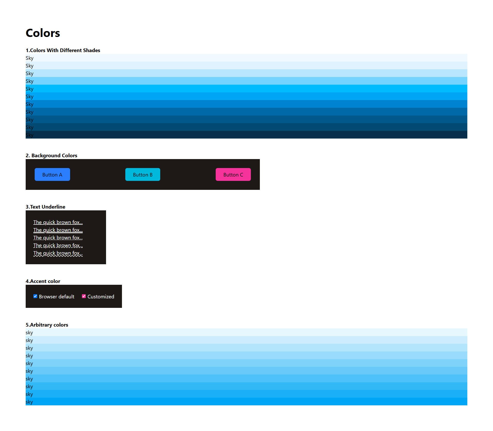
### 2.Container & Spacing
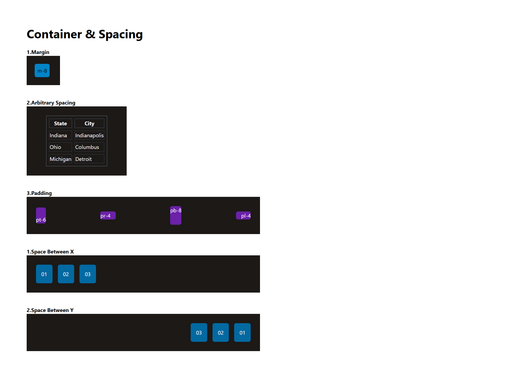
### 3.Typography
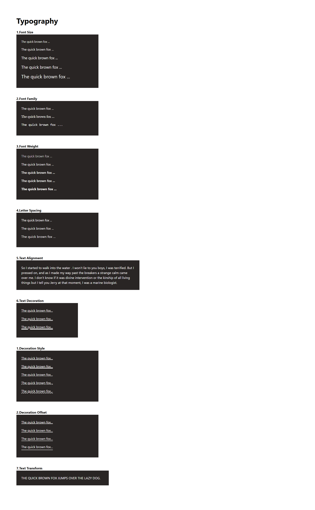
### 4.Sizing
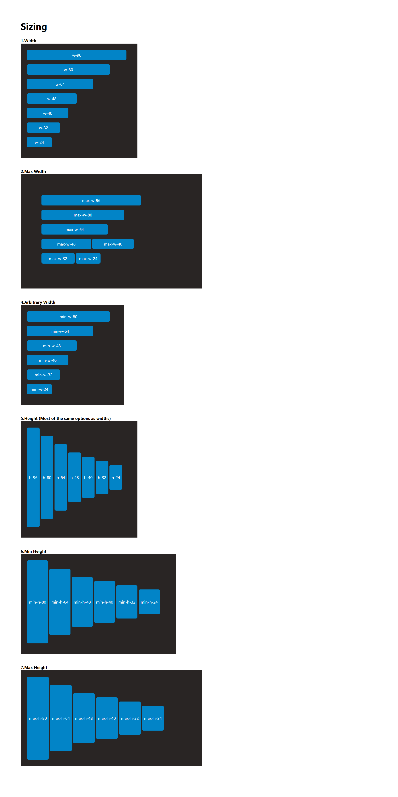
### 5.TailwindCSS
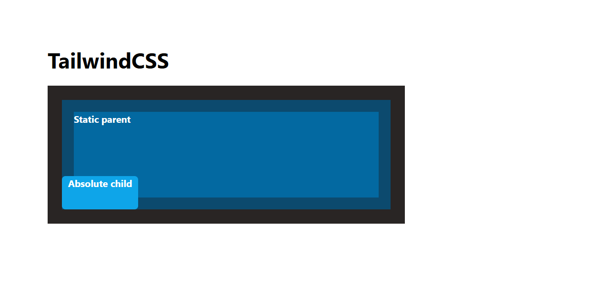
### 6.Backgrounds & Shadows
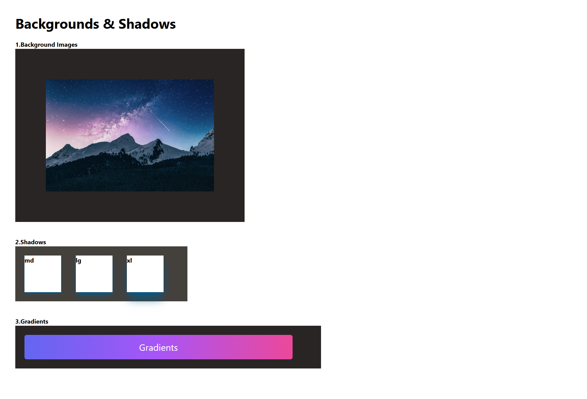
### 7.Borders
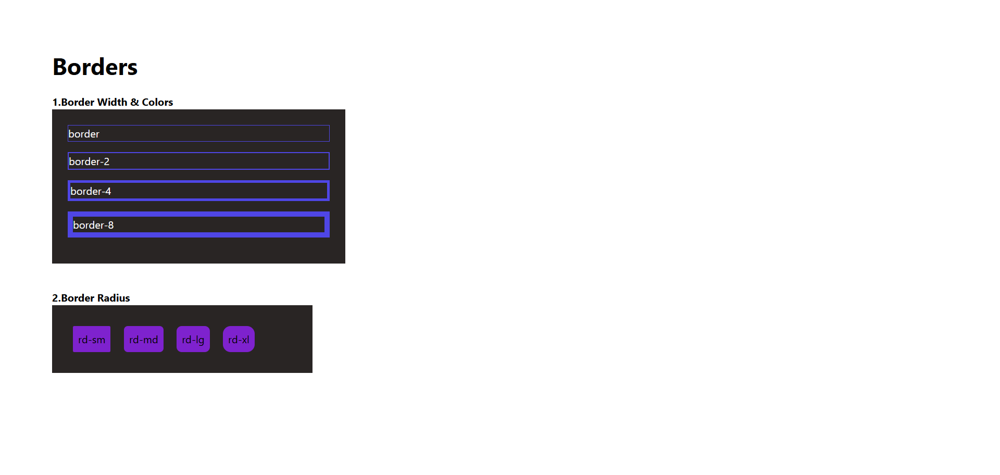
### 8.Filters
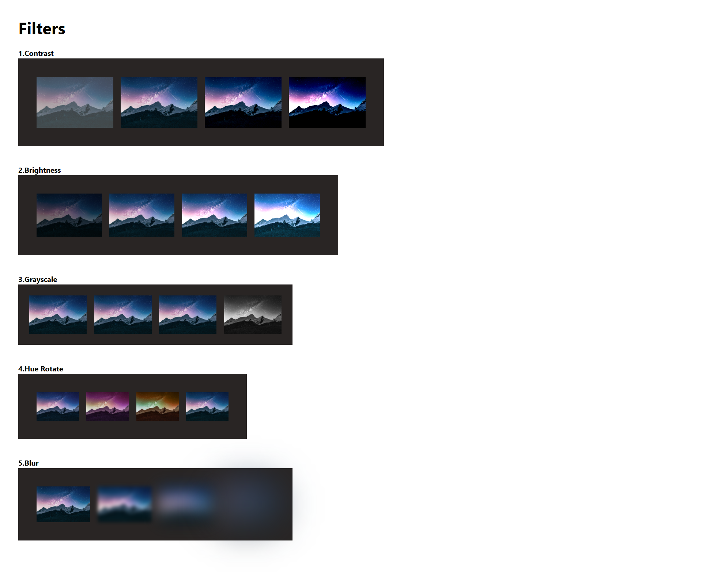
### 9.Breakpoints & Media Queries

### 10.Flexbox
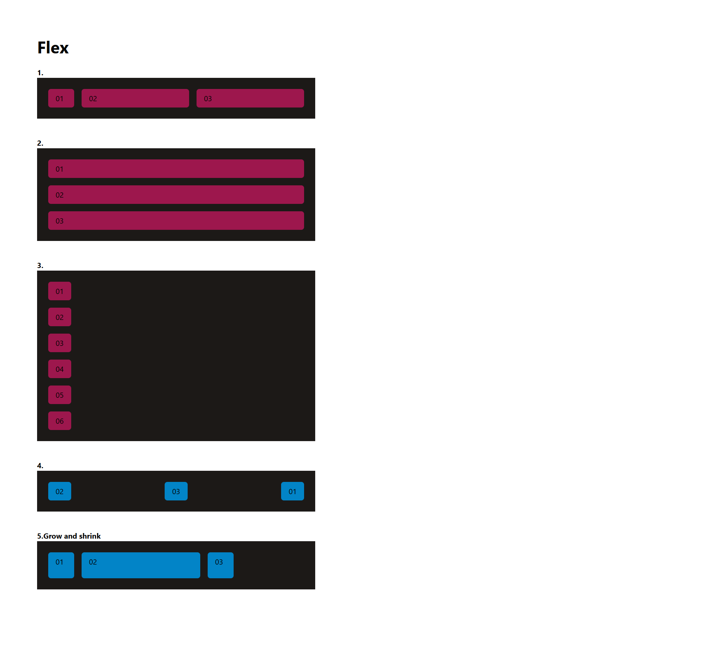
### 11.Grid
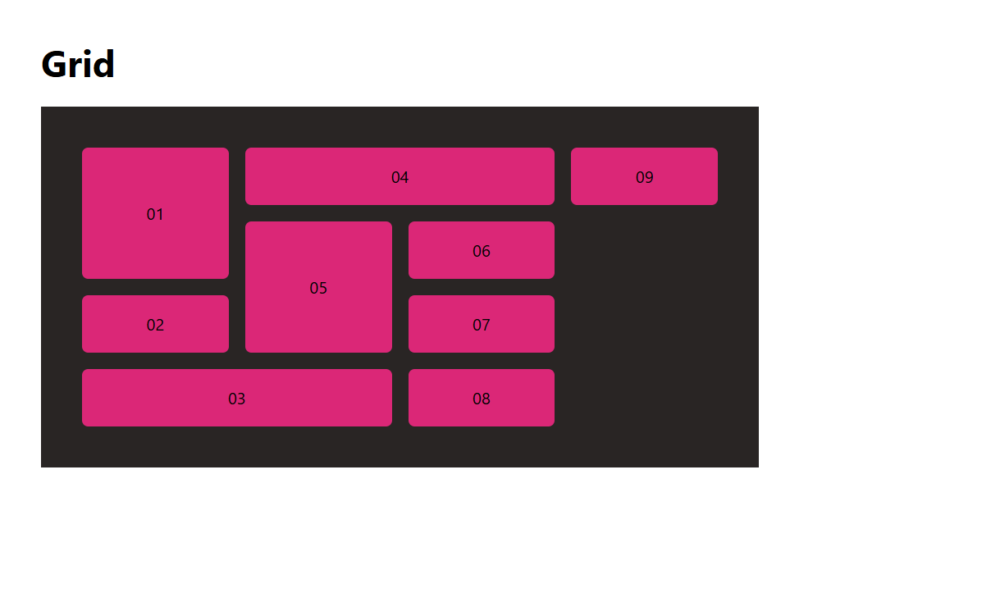
### 12.Transform & Transition
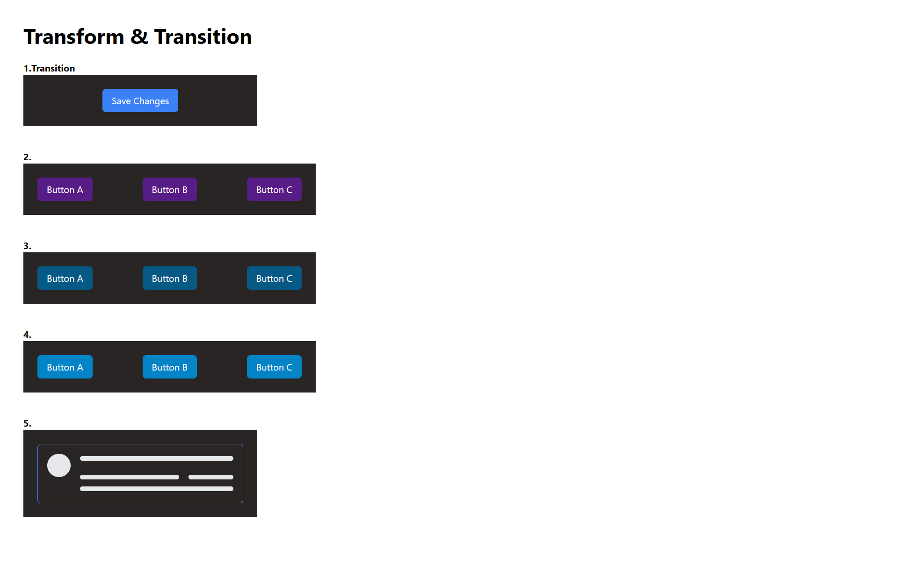